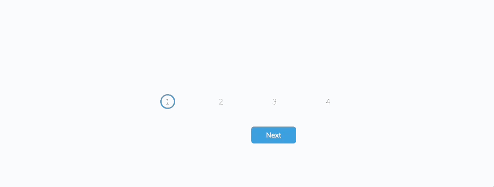
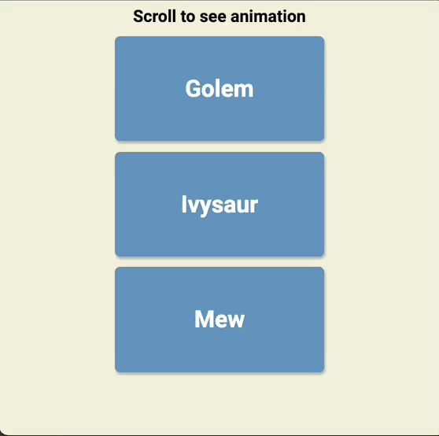

# 50 Projects in 50 Days

Completing [50 Projects 50 Days](https://www.udemy.com/course/50-projects-50-days/) to sharpen up my HTML, CSS and Javascript skills!  

## Day 1 - Expanding Cards
Project Demo  

## Day 2 - Progress Steps
Project Demo  

## Day 3 - Rotation Nav
Project Demo  

## Day 4 - Hidden Search Widget
Project Demo  

## Day 5 - Blurry Loading
Project Demo  

## Day 6 - Scrolling Animation + Pokemon Api call
Project Demo  
**Golem** is not a Pokemon and it somehow came about from the API call 😅  
Pokemons are from the first generation, which is 151 Pokemon in total!    

## Day 7 - Split Landing Page + audio on hover
Project Demo  
Added Pikachu and Eevee voice/cry to play on hover    

